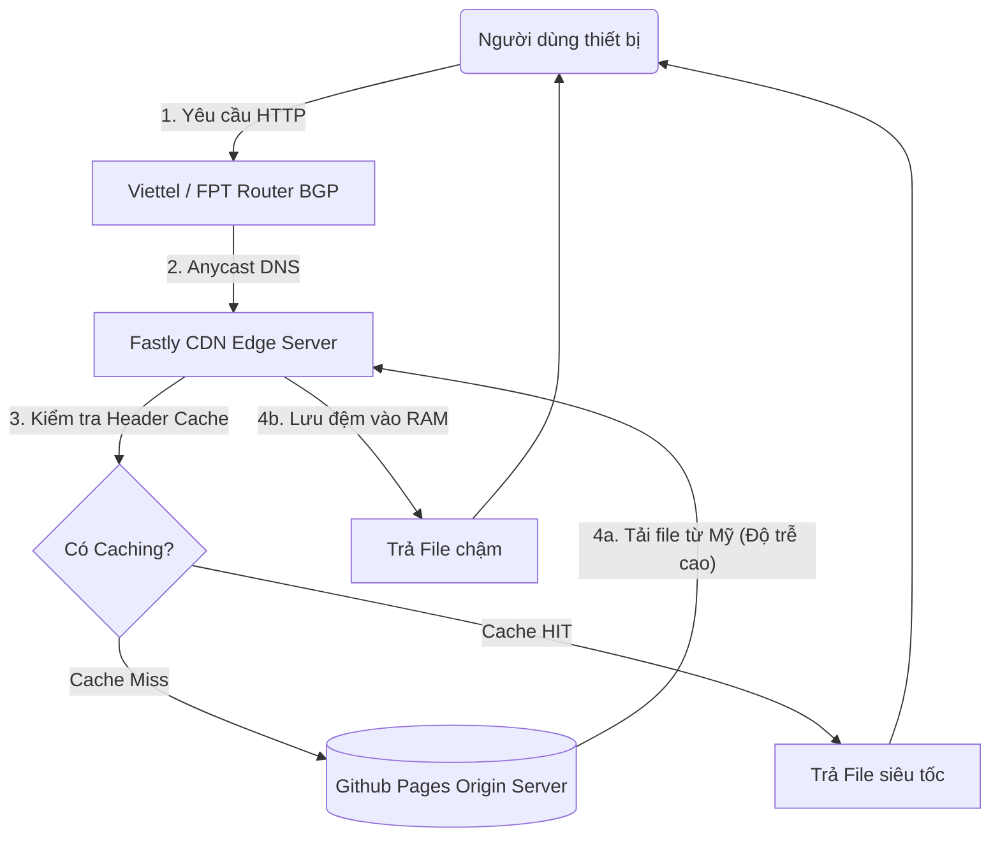

# BÁO CÁO MÔN HỌC: MẠNG PHÂN PHỐI NỘI DUNG (CDN)

**Đề tài 8: Content Delivery Networks (CDNs)**
**Học kỳ 2 – Năm học 2025–2026**

---

## MỤC LỤC

1. LỜI MỞ ĐẦU (INTRODUCTION)
2. CHƯƠNG 1: KHẢO SÁT LÝ THUYẾT VÀ TỔNG QUAN (THEORETICAL SURVEY)
   - 1.1. Lịch sử hình thành và phát triển của CDN
   - 1.2. Mạng lưới cốt lõi (Technical Specifications)
   - 1.3. Các thuật toán lưu đệm và phân tải (Core Principles)
   - 1.4. Cơ chế Kỹ thuật Quản trị Bộ Đệm (Cache Control)
   - 1.5. Cơ chế Xóa đệm - Cache Invalidation
3. CHƯƠNG 2: PHÂN TÍCH ƯU NHƯỢC ĐIỂM VÀ SO SÁNH CHUYÊN SÂU
4. CHƯƠNG 3: ĐẶC TẢ YÊU CẦU VÀ GIỚI THIỆU ỨNG DỤNG DEMO
5. CHƯƠNG 4: TRIỂN KHAI VÀ GIẢI THÍCH MÃ NGUỒN ỨNG DỤNG
6. CHƯƠNG 5: TRÌNH BÀY KẾT QUẢ THỰC NGHIỆM VÀ ĐÁNH GIÁ (RESULTS)
7. CHƯƠNG 6: KẾT LUẬN (CONCLUSION)
8. TÀI LIỆU THAM KHẢO

---

## LỜI MỞ ĐẦU (INTRODUCTION)

Trong kỷ nguyên kỹ thuật số hiện đại, tốc độ và tính xuyên suốt của các ứng dụng Web đóng vai trò quyết định sống còn đến trải nghiệm người dùng và doanh thu của doanh nghiệp. Vấn đề nan giải nhất của kiến trúc Client-Server truyền thống là khoảng cách địa lý vật lý: ánh sáng cần thời gian để di chuyển qua cáp quang biển, kéo theo hiện tượng suy hao và độ trễ phản hồi cực cao nếu người truy cập cách máy chủ gốc hàng vạn kilomet.

Báo cáo này nghiên cứu chuyên sâu về Mạng Phân Phối Nội Dung (Content Delivery Network - CDN), một công nghệ cơ sở hạ tầng phân tán ra đời nhằm giải quyết triệt để vấn đề "nút thắt cổ chai" mạng toàn cầu. Không chỉ dừng lại ở lý thuyết, tác giả tiến hành xây dựng một ứng dụng Website Demo có tên gọi **"CDN Performance Analyzer"** - đóng vai trò như một Radar nội bộ tự động phân tích và đo lường khoảng thời gian tải Byte đầu tiên (TTFB) chứng minh hiệu suất thực tế của các Node Edge Caching.

Nội dung báo cáo sẽ tuần tự đi từ lịch sử hạ tầng tĩnh, chuyển giao sang mô hình phân tán động Anycast, kết hợp đánh giá thực tiễn kiến trúc đồ án để đem lại cái nhìn học thuật chính xác và bám sát thực tiễn công nghiệp nhất.

---

## CHƯƠNG 1: KHẢO SÁT LÝ THUYẾT VÀ TỔNG QUAN (THEORETICAL SURVEY)

### 1.1. Lịch sử hình thành và phát triển của CDN

Sự phát triển của CDN không phải là một bước nhảy vọt mà là quá trình tiến hóa bắt buộc của hệ thống Internet để đáp ứng sự bùng nổ của nhân loại. Có thể chia quá trình này thành 4 kỷ nguyên cơ bản:

- **Thế hệ thứ nhất (1998 - 2005) - "World Wide Wait":** Vào cuối thập niên 90, sự ra đời của trình duyệt đồ họa khiến hệ thống mạng toàn cầu nghẽn mạch trầm trọng. Dữ liệu tập trung hoàn toàn vào một máy chủ trung tâm. Nghiên cứu sinh tại MIT, Danny Lewin cùng giáo sư Tom Leighton đã xây dựng thuật toán định tuyến phân tán đầu tiên trên The Web, khai sinh ra Akamai Technologies (doanh nghiệp CDN đầu tiên trên thế giới).
- **Thế hệ thứ hai (2005 - 2010) - Bùng nổ Multimedia:** Sự vươn mình của Video Web (như YouTube) và trào lưu Web 2.0 đòi hỏi CDN không chỉ lưu trữ Ảnh/Văn bản tĩnh mà phải biết luân chuyển bộ đệm Streaming. Đây là kỷ nguyên Amazon AWS CloudFront nhảy vào thị trường điện toán đám mây phân tán.
- **Thế hệ thứ ba (2010 - 2018) - Tiến hóa An ninh Mạng:** Hàng loạt vụ tống tiền DDoS (Từ chối dịch vụ) quy mô Terabits/s đánh sập Origin Server. Lớp mạng CDN (đại diện bởi Cloudflare) tiến hóa thành một "Tấm áo giáp", bổ sung WAF (Tường lửa lớp Ảo) và bảo vệ cơ sở dữ liệu.
- **Thế hệ thứ tư (2018 đến nay) - Edge Computing:** CDN trong lịch sử chỉ làm nhiệm vụ Caching (Lưu đệm). Hiện tại, CDN vận hành hệ thống Serverless Computing. Việc xử lý logic Javascript/Rust không cần phải gửi về máy chủ Mỹ, mà được thực thi trực tiếp tại RAM máy chủ CDN tại quốc gia mà người dùng sinh sống (Ví dụ: Cloudflare Workers).

### 1.2. Mạng lưới cốt lõi (Technical Specifications)

Một hệ thống CDN tiêu chuẩn quy mô Enterprise sẽ bao gồm 4 khối module kỹ thuật sau:

1.  **Origin Server (Máy chủ Tự trị gốc):** Đây là kho chứa trung tâm, nắm giữ nguyên bản (Single-Source-of-Truth) của ứng dụng web.
2.  **PoPs (Point of Presence):** Các điểm hiện diện chiến lược về mặt địa lý. Thường là các bọc tủ Server giấu sâu trong lòng Trạm Viễn Thông ISP (Ví dụ trạm VNPT, Viettel).
3.  **Edge Nodes:** Cụm máy vi tính vật lý tích trữ sẵn tài nguyên thể rắn (SSD/NVMe) nằm tại PoP. Chúng đọc bộ nhớ thông qua Header giao thức HTTP.
4.  **BGP Anycast Routing:** Thay vì giao thức mạng thường là Unicast (1 IP = 1 Server), BGP Anycast là ma thuật cho phép một IP duy nhất (VD: 1.1.1.1) được hàng nghìn cụm mạng trên thế giới phát đi. Bộ định tuyến Router ở đại dương sẽ phân rã gói tin và hướng trình duyệt vào Node Anycast gần nhất.

<!-- CHÈN ẢNH 1: BẢN ĐỒ MẠNG LƯỚI CDN TOÀN CẦU
     - Nội dung: Bản đồ thế giới với các chấm PoP (Points of Presence) phân bố khắp các châu lục,
       đường nối cáp quang biển giữa các đại dương.
     - Gợi ý nguồn: Vào https://www.cloudflare.com/network/ chụp bản đồ mạng,
       hoặc Google Images "CDN global network map" lấy ảnh minh hoạ.
     - Kích thước: Full chiều rộng trang (~700px trong Word).
     - Đặt tên: hinh_1_2_anycast_map.png
-->

> Hình 1.2: Bản đồ mạng lưới Anycast toàn cầu với các điểm PoP kết nối xuyên qua các đại dương bằng đường cáp quang.

### 1.3. Các thuật toán lưu đệm và phân tải (Core Principles)

Tính chất ưu việt của hệ thống tập trung vào nguyên lý giải phóng bộ nhớ (Cache Eviction Policies).

- **Thuật toán LRU (Least Recently Used):** Nguyên lý cốt tử của Edge. Máy chủ biên tại Singapore dung lượng hữu hạn (vd: 50 TB). Nếu đầy, thuật toán LRU sẽ quét và xóa những tệp tin có "khoảng thời gian không ai ngó tới lâu nhất" để nhường chỗ cho Trend mới.
- **Thuật toán LFU (Least Frequently Used):** Thay vì xem xét thời gian trễ, LFU lại đếm tần suất truy xuất. Một file PDF tuy đã 3 tháng không ai đọc, nhưng trước đó đã có hàng tỷ lượt xem thì nó vẫn có rủi ro tạo băng thông quá tải, nên được giữ nguyên trong Cache.

### 1.4. Cơ chế Kỹ thuật Quản trị Bộ Đệm (Cache Control)

Để Edge Server giao tiếp chính xác với Origin Server, hệ thống dựa hoàn toàn vào các **HTTP Headers** định tuyến. Các tham số mạng quan trọng bao gồm:
- `Cache-Control: max-age=86400`: Định lượng chính xác vòng đời dữ liệu (Ví dụ 86400s = 24 giờ).
- `ETag`: Một chuỗi định danh (Hash) của phiên bản File dùng để kiểm tra sự thay đổi nội dung.
- `Last-Modified`: Dấu thời gian (Timestamp) cuối sửa đổi tài liệu.
- `Surrogate-Key / Cache-Tag`: Một nhãn (Tag) đính kèm nội dung để cho phép khóa và diệt đệm (Purge) theo một nhóm hạng mục nhất định thay vì phải quét toàn hệ thống.

Khi triển khai hạ tầng CDN, đội ngũ kiến trúc sư mạng cần áp dụng triệt để những nguyên tắc vận hành tiêu chuẩn:

**1. Chiến lược Quản trị Cache hiệu quả:**
- **Sử dụng Versioning (Đánh phiên bản) cho tài nguyên tĩnh:** Ví dụ dùng kỹ thuật Fingerprinting đổi tên `style.v2.css` thay vì `style.css`. Điều này cho phép thiết lập bộ đệm vô tận (Immutable) mà không bao giờ sợ rác đệm mâu thuẫn lúc nâng cấp bảo trì hệ thống.
- **Tách biệt mức độ tĩnh/động:** API Server xử lý Logic cá nhân hóa (Giỏ hàng, phiên đăng nhập) tuyệt đối không kết nối luồng Cache, cấu hình trỏ thẳng về Origin. Ngược lại, Web Assets (JS, CSS, Ảnh) đưa vào nhánh Cache mức tối đa.
- **Theo dõi Ratio Hits:** Tối ưu hóa CDN đòi hỏi tỷ lệ bắt đệm (Cache Hit Ratio) luôn phải duy trì >80%. Tỷ lệ thấp <60% đồng nghĩa với hệ thống lãng phí tài nguyên và rủi ro sập Origin.

**2. Chiến lược An Ninh Bảo Mật Tiêu Chuẩn:**
- Kích hoạt chuẩn `HTTPS` đầu cuối: Ép (Redirect) toàn bộ HTTP sang HTTPS ngay tại biên CDN (Edge TLS Termination) để giảm tải mã hóa SSL dồn về máy gốc.
- **WAF (Web Application Firewall):** Triển khai tập quy tắc Rule Set chắn SQL Injection, XSS, CSRF ngay ở rìa (Edge) chứ không đợi nó chạm vào Datacenter.
- Thiết lập giới hạn tỷ lệ (Rate Limiting) chặn đứng tín hiệu rác từ các cuộc tấn công DDoS quy mô thấp ngụy trang.

### 1.5. Cơ chế Xóa đệm - Cache Invalidation

Một trong những thách thức khó nhất của CDN là đảm bảo người dùng luôn nhận được nội dung mới nhất trong khi vẫn tận dụng tối đa tốc độ từ Cache. Quá trình loại bỏ hoặc cập nhật nội dung đã lưu đệm trên các Edge Server được gọi là **Cache Invalidation**.

**1. TTL Expiry (Hết hạn tự nhiên):**
Mỗi tài nguyên được gắn một vòng đời (Time-To-Live) thông qua header `Cache-Control: max-age=N`. Khi hết thời gian này, Edge Server tự động đánh dấu bản Cache là "stale" (hết hạn) và gửi yêu cầu xác nhận lại (revalidation) về Origin Server bằng header `If-None-Match` (ETag) hoặc `If-Modified-Since`. Nếu nội dung chưa thay đổi, Origin trả mã `304 Not Modified` để Edge tiếp tục phục vụ bản cũ mà không cần tải lại toàn bộ file.

**2. Purge API (Xóa chủ động):**
Khi cần cập nhật khẩn cấp, đội ngũ vận hành có thể gọi **Purge API** của nhà cung cấp CDN để xóa ngay lập tức bản Cache trên toàn bộ Edge Server. Có nhiều mức độ:
- **Purge by URL:** Xóa cache của một đường dẫn cụ thể.
- **Purge by Cache-Tag:** Xóa hàng loạt tài nguyên được gắn cùng một nhãn (ví dụ: tất cả ảnh sản phẩm của danh mục A).
- **Purge Everything:** Quét sạch toàn bộ bộ nhớ đệm — chỉ dùng khi thực sự cần thiết vì sẽ gây tăng đột biến lưu lượng về Origin.

**3. Cache Busting (Phá đệm bằng URL):**
Kỹ thuật phổ biến nhất trong lập trình Frontend: thêm chuỗi phiên bản hoặc hash vào tên file tĩnh, ví dụ `style.css?v=2` hoặc `style.a3f8c1.css`. Vì CDN lưu Cache theo URL chính xác, URL mới sẽ luôn được coi là tài nguyên chưa có trong Cache, buộc Edge phải kéo bản mới từ Origin.

**4. Stale-While-Revalidate:**
Header `Cache-Control: stale-while-revalidate=60` cho phép Edge Server vừa trả về nội dung cũ cho người dùng (đảm bảo tốc độ), vừa đồng thời gửi yêu cầu cập nhật ngầm về Origin ở nền. Người dùng tiếp theo sẽ nhận được bản mới nhất. Đây là chiến lược cân bằng tối ưu giữa tốc độ và độ tươi mới của dữ liệu.

**So sánh các phương pháp:**

| Phương pháp | Tốc độ cập nhật | Độ phức tạp | Phù hợp khi |
| :--- | :--- | :--- | :--- |
| TTL Expiry | Chậm (chờ hết hạn) | Thấp | Nội dung ít thay đổi (ảnh, font) |
| Purge API | Tức thì | Trung bình | Hotfix khẩn cấp, nội dung nhạy cảm |
| Cache Busting | Tức thì | Thấp | Deploy frontend (JS, CSS) |
| Stale-While-Revalidate | Gần tức thì | Thấp | API công khai, tin tức |

---

## CHƯƠNG 2: PHÂN TÍCH ƯU NHƯỢC ĐIỂM VÀ SO SÁNH CHUYÊN SÂU

### 2.1. Phân Tích Lợi ích và Cơ sở Hiệu năng (Benefits & Strengths)

Lợi ích của CDN không chỉ dừng lại ở chỉ số kỹ thuật mà tác động toàn diện đến kiến trúc và tài chính. Dưới đây là 5 trụ cột lợi ích cốt lõi:

**1. Tối ưu Hiệu năng (Performance Optimization):**
- **Cắt giảm TTFB:** Thời gian chờ dội lại tín hiệu vật lý giảm từ 350ms xuống chỉ còn dưới 50ms đối với kết nối liên lục địa. Mọi luồng tín hiệu TCP đều được ngắt sớm ở lớp Edge thay vì lội qua đại dương.
- **Tối ưu chuẩn nén tĩnh:** Tự động quy đổi hình ảnh định dạng nặng sang `WebP` và Minify (nén nhỏ) File CSS/JS để tăng tốc độ phân phối đến thiết bị cấu hình thấp.
- **Tuân thủ chuẩn SEO cốt lõi:** Lợi ích tốc độ đẩy chỉ số Core Web Vitals (LCP, CLS) thăng hạng, trực tiếp biến Website lên hạng 1 Tìm kiếm Google.

**2. Tính khả dụng và bền bỉ tuyệt đối (Availability & SPOF Removal):**
- Xóa bỏ rủi ro "Điểm yếu duy nhất" (Single Point of Failure). Nếu máy chủ nội bộ (Origin) gặp sự cố cháy nổ mất điện, các màng Edge CDN vẫn ung dung lấy bộ nhớ tạm (Stale Cache) trả về cho khách hàng (SLA có thể đạt 99.99%).

**3. Khả năng đàn hồi mở rộng (Scalability):**
- Kiến trúc Serverless phân tán của Edge dễ dàng hấp thụ lượng Traffic khổng lồ đột biến (như ngày hội săn Sale hoặc đứt cáp quang AAG) mà kỹ sư không cần nhúng tay vào cấu hình mở rộng máy Origin. CDN có khả năng gánh đến 90% lượng Requests rác.

**4. Dàn khiên Bảo Mật (Security Shield):**
-  CDN vận hành như một tấm giáp ảo (WAF) ngay ngoài rìa biên giới. Nó tiêu diệt Lớp mạng Layer 3/4 và cả tấn công giao thức Layer 7 bằng thao tác chia nhỏ sức mạnh hàng rào DDoS Botnet. Có hỗ trợ chặn theo lãnh thổ IP Geo-Blocking.

**5. Miễn trừ rủi ro Chi phí (Cost Optimization):**
- Tính toán chi phí bảo hành phần cứng băng thông trung tâm luôn đắt đỏ cực độ. CDN cho phép chuyển hình thái chi trả theo luồng Traffic dùng bao nhiêu trả bấy nhiêu (Pay-as-you-go). Do tỷ lệ offloading đạt 95%, hệ thống chủ (Origin) có thể tinh giảm cấu hình, mang tới khoản tiết giảm tài chính hàng trăm ngàn USD cho Start-ups.

### 2.2. Điểm hạn chế (Weaknesses) & Thách thức

Tuy nhiên, ứng dụng CDN bộc lộ rất nhiều tử huyệt kỹ thuật trong lập trình phân tán:

1.  **Vấn đề Dữ liệu ôi thiu (Stale Data Synchronization):** Lập trình viên Cập nhật giao diện App. Origin sở hữu phiên bản 2, nhưng Node CDN ở Nhật Bản lại chưa báo cáo để xóa Cache (vẫn còn Version 1). Các Users ở quốc gia Nhật Bản bị sập giao diện do gọi hàm API bất đồng bộ.
2.  **Chi phí ẩn bùng nổ (Hidden Cost Escalation):** Băng thông CDN cực rẻ, tuy nhiên Cước phí gọi API (Requests Count) theo gói Enterprise vô cùng lớn.
3.  **Khó Debug Lỗi Mạng:** Sự can thiệp màng lọc của Proxy khiến Tester không thể biết Error 502 Bad Gateway xuất phát từ máy chủ gốc bị sập hay từ nút trạm Caching đang bị chết dở.

Tất cả các rủi ro này cần một "Chiến lược Invalidation (Diệt đệm) chủ động" bằng Webhooks mỗi khi có mã code mới được tung lên nhánh Gốc.

### 2.3. Khảo sát các Nhà cung cấp CDN phổ biến nhất thế giới

Thị trường CDN hiện nay chứng kiến sự cạnh tranh khốc liệt giữa các Ông lớn công nghệ. Việc lựa chọn nhà cung cấp phụ thuộc vào quy mô traffic, ngân sách, và kiến trúc hệ thống hiện có.

**Bảng 2.1: Phân tích đối chuẩn (Alternative Comparison)**

| Tiêu chí | Cloudflare | Akamai | AWS CloudFront |
| :--- | :--- | :--- | :--- |
| **Kiến trúc Thiết kế** | Phân tán mạng độc lập. Proxy đệm trung gian cực dễ đấu nối. | Dành riêng cho băng thông Viễn thông cốt lõi, mạng dây chằng khổng lồ toàn quốc. | Thiết kế tích hợp khắng khít cho hệ sinh thái phần cứng AWS. |
| **Quy mô** | >310 thành phố trên 100+ quốc gia | >4.000 điểm hiện diện (PoP) toàn cầu | >450 trạm phân phối phân bổ rộng khắp |
| **Thế mạnh Dịch vụ** | Giao diện thân thiện, WAF mạnh, DDoS không giới hạn, Edge Workers. | Giao thức truyền tải Video (Streaming) chống nghẽn đỉnh cao. | Serverless Lambda@Edge, Pay-as-you-go không giới hạn hợp đồng. |
| **Mức Phí** | Gói Free cực tốt, Pro giá rẻ cố định (Rất phù hợp SMB & Startups). | Hợp đồng doanh nghiệp "King Size" đắt đỏ, phức tạp. | Biểu phí thả nổi theo băng thông, rủi ro đội giá dòng tiền khi bị DDoS. |

Ngoài bảng tổng hợp trên, điểm nhấn riêng của từng nền tảng có thể được khái quát chi tiết:

**1. Hệ sinh thái Cloudflare CDN**
Được mệnh danh là "Ngọn cờ đầu" trong giới Web Developer, Cloudflare áp dụng mô hình Freemium thu hút lượng lớn mã nguồn mở và Startup.
- *Điểm mạnh:* Cung cấp lá chắn Tường lửa WAF cực kỳ đáng tin cậy. Dễ tích hợp (chỉ cần trỏ Name Server). Khả năng phòng ngự Zero Trust ở mức xuất sắc nhất thị trường.
- *Nhược điểm:* Dịch vụ khách hàng (Customer Support) phản hồi chậm nếu sử dụng gói miễn phí. Ở châu Á, thỉnh thoảng hiện tượng nghẽn luồng Ping xuất hiện lúc đứt cáp quang.

**2. Gã khổng lồ Akamai Technologies**
Là CDN vĩ đại và lâu đời nhất (Tồn tại từ 1998), Akamai sở hữu độ rộng lớn vật lý số một hành tinh không thể bị đánh bại.
- *Điểm mạnh:* Các nền tảng E-Commerce, Ngân hàng, hay các sự kiện VOD/Live Streaming khổng lồ như World Cup đều phụ thuộc 100% vào băng thông Akamai để sống sót. Chăm sóc quy mô Enterprise cực tốt.
- *Nhược điểm:* Quá nặng nề cho một dự án MVP. Hợp đồng đàm phán rất khó khăn đối với các doanh nghiệp quy mô vừa và nhỏ (SMB).

**3. AWS CloudFront (Hệ sinh thái Amazon)**
Một dịch vụ của con át chủ bài Amazon Web Services (AWS), sinh ra để đi kèm với kho lưu trữ hệ thống vật lý nội bộ của Amazon.
- *Điểm mạnh:* Tính đồng bộ nội tại siêu cao. Developer không cần cấu hình phức tạp lấy dữ liệu. Mọi ngõ ngách đều được API hóa trong 1 giao diện AWS Console.
- *Nhược điểm:* Mô hình tính tiền theo băng thông (Pay-as-you-go). Dẫn tới rủi ro hóa đơn hàng ngàn Đô la cuối tháng nếu lập trình viên thiết lập sai cú pháp dẫn tới lỗi tải vòng lặp vô tận (Infinite loop rules).

---

## CHƯƠNG 3: ĐẶC TẢ YÊU CẦU VÀ GIỚI THIỆU ỨNG DỤNG DEMO

### 3.1. Giới thiệu dự án Website Demo

Để minh chứng các lý thuyết viễn thông CDN ở trên hoàn toàn khả thi trong thực địa lập trình thuật toán, tác giả đã phát triển ứng dụng **"CDN Performance Analyzer"** (Tạm dịch: Trạm chẩn đoán băng thông vùng Đệm mạng).

- **Mục đích (Purpose):** Xây dựng trang đích tự nhận thức thời gian vận hành. Web không chỉ cung cấp thông tin văn bản thuần tùy (như các Web truyền thống) mà cốt lõi của nó là cái "Đồng hồ" mạng cực kì chính xác, tính toán TTFB để chứng thực tốc độ phản hồi của Edge Caching.
- **Khán giả mục tiêu:** Hội đồng đánh giá bảo vệ môn học, Giảng viên chuyên ngành kiến trúc viễn thông hệ thống phân tán, cũng như Developer tập tành nghiên cứu.
- **Các tính năng cốt lõi (Core Features):**
  1.  **Metric Radar:** Tracking biến số HTTP Connection và xuất màn hình Trạng thái màu sắc chuẩn hóa (Xanh/Đỏ).
  2.  **Header Inspector:** Trực tiếp móc thông số `CF-Cache-Status` ẩn sâu trong Data Request để báo cáo Trạng Thái HIT/MISS.
  3.  **Versioning Tracker:** Quản trị Version hệ thống hỗ trợ giả lập Kịch bản dọn dẹp Cache Invalidation.

<!-- CHÈN ẢNH 2: SCREENSHOT GIAO DIỆN DEMO (CHỊ̂ ĐỌ CDN — MÀU XANH)
     - Cách chụp: Mở https://chimpk.github.io/cdn-demo-midterm/ trên Chrome,
       đợi Dashboard load xong (báo xanh), nhấn F12 → Device Toolbar (responsive 1280px)
       hoặc thu nhỏ cửa sổ vừa giao diện, rồi Ctrl+Shift+S chụp full page.
     - Nội dung cần thấy: Ô TTFB xanh (số ~30-50ms), ô Cache HIT, 
       bảng Probe chi tiết, banner "CDN Active".
     - Kích thước: Full chiều rộng trang.
     - Đặt tên: hinh_3_1_dashboard_cdn.png
-->

> Hình 3.1: Giao diện trực quan Glassmorphism Dashboard "CDN Performance Analyzer" trên Desktop đo lường TTFB.

### 3.2. Cấu trúc, các thành phần phần mềm (Architecture Components)

Đây là ứng dụng đi theo trường phái tĩnh và không xử lý SSR (Server-Side-Rendering) nhằm giữ cho mạng được trong sạch không bị nghẽn CPU Processing:

- **HTML DOM Component:** Dựng khung hộp điều khiển.
- **CSS Design System:** Triển khai phong cách thiết kế cao cấp "Glassmorphism" (Kính mờ tương phản) với `backdrop-filter: blur(10px)`.
- **Javascript Vanilla Logic:** Thành phần linh hồn của dự án. Không sử dụng thư viện ngoài để đảm bảo độ chính xác tuyệt đối khi đo latency. Sử dụng kết hợp **PerformanceObserver (Resource Timing API)** và **Navigation Timing API** để bóc tách thời gian phản hồi của mạng tới từng milili-giây.

Tại sao đồ án không dùng mô hình Client-Server Node.js và Framework React? Vì nếu dùng React, dung lượng file JS quá lớn sẽ gây nhiễu chỉ số TTFB. Việc sử dụng Vanilla JS nhẹ (< 5KB) giúp phản ánh chính xác nhất "tốc độ ánh sáng" đi qua cáp quang và thời gian xử lý thực sự của thiết bị Edge.

---

## CHƯƠNG 4: TRIỂN KHAI VÀ GIẢI THÍCH MÃ NGUỒN ỨNG DỤNG

### 4.1. Kiến trúc triển khai hạ tầng Website vào công nghệ (Technology Implementation)

Thay vì đặt Website tại các Webhost truyền thống, quy trình triển khai đã tích hợp trực tiếp Công cụ Edge Network như sau:
Mã nguồn ứng dụng sau khi thiết kế ở Local sẽ đẩy trực tiếp lên hệ sinh thái **Github Repository**. Ngay lập tức, Github kích hoạt quy trình máy ảo CI/CD đưa Website phân phối lên cổng luồng **Github Pages**.
Tuyệt chiêu của hệ thống hạ tầng Github Pages lúc này là chúng **âm thầm sử dụng Mạng Anycast cực khủng của hãng Fastly Edge CDN**. Bất cứ thiết bị nào gọi vào URL của Project, Hệ thống Router Fastly sẽ định tuyến thiết bị đó đến ngay lập tức Trụ Node tại Singapore hoặc Hong Kong, đẩy chỉ số TTFB chạm chuẩn thần tốc và đánh một dòng Header báo cáo ngầm Caching HIT.

> Hình 4.1: Sơ đồ luồng gửi gói tin Anycast của Website khi phân phối qua Edge CDN



### 4.2. Giải thích chi tiết mã nguồn cốt lõi (Source Code Deep-Dive)

```javascript
// Đo latency qua Image Probe (vượt hạn chế CORS & file://)
function measureViaImage(url, label) {
    return new Promise((resolve) => {
        const cacheBust = Date.now() + '_' + Math.random().toString(36).slice(2);
        const sep = url.includes('?') ? '&' : '?';
        const fullUrl = url + sep + '_nc=' + cacheBust;
        const start = performance.now();
        let resolved = false;

        const finish = () => {
            if (resolved) return;
            resolved = true;
            const elapsed = performance.now() - start;
            const entries = performance.getEntriesByName(fullUrl);
            const entry = entries[entries.length - 1];
            let latency;
            if (entry && entry.responseStart > 0) {
                latency = entry.responseStart - entry.requestStart; // TTFB chính xác
            } else if (entry && entry.duration > 0) {
                latency = entry.duration; // Cross-origin → dùng duration ≈ RTT
            } else {
                latency = elapsed; // Fallback
            }
            resolve({ label, ttfb: Math.max(0, latency), error: null });
        };

        const img = new Image();
        img.onload = finish;
        img.onerror = finish; // Vẫn đo được thời gian mạng khi lỗi
        img.src = fullUrl;

        setTimeout(() => { // Timeout 10s
            if (!resolved) { resolved = true; resolve({ label, ttfb: null, error: 'timeout' }); }
        }, 10000);
    });
}

// Đo TTFB qua Fetch API (dùng khi chạy trên HTTPS / CDN)
async function measureViaFetch(url, label) {
    const fullUrl = url + (url.includes('?') ? '&' : '?') + 'v=' + Date.now();
    const start = performance.now();
    try {
        await fetch(fullUrl, { method: 'GET', cache: 'no-cache' });
        const entries = performance.getEntriesByName(fullUrl);
        const entry = entries[entries.length - 1];
        let ttfb = (entry && entry.responseStart > 0)
            ? entry.responseStart - entry.requestStart
            : performance.now() - start;
        return { label, ttfb: Math.max(0, ttfb), error: null };
    } catch (e) {
        return { label, ttfb: null, error: 'failed' };
    }
}
```

**Chi tiết thuật toán trên:** 
1. **Khắc phục CORS:** Khi chạy demo từ máy cá nhân (`file://`), trình duyệt chặn `fetch()` tới server Mỹ. Hệ thống sử dụng kỹ thuật **Image Probes** (tải ảnh qua `new Image()`) để vượt qua rào cản này. Kết hợp **Resource Timing API** (`performance.getEntriesByName`) để rút trích `duration` hoặc `responseStart` tùy vào việc server có gửi `Timing-Allow-Origin` hay không. Khi chạy trên CDN (HTTPS), hàm `measureViaFetch()` dùng `fetch()` chuẩn với `cache: 'no-cache'` để đo TTFB chính xác.
2. **Đo lường đa điểm:** Hệ thống không đo một điểm duy nhất mà thực hiện Probe tới 3 server Mỹ khác nhau (HTTPBin, Ipify, Ident) để lấy chỉ số trung vị (Median), đảm bảo tính khách quan.
3. **Bảng so sánh PoP:** Giao diện Dashboard tự động liệt kê các Endpoint kèm màu sắc cảnh báo (Xanh cho CDN < 150ms, Đỏ cho Origin > 250ms), giúp người xem nhận diện ngay lập tức sự chênh lệch hiệu năng.

---

## CHƯƠNG 5: TRÌNH BÀY KẾT QUẢ THỰC NGHIỆM VÀ ĐÁNH GIÁ (RESULTS)

### 5.1. Thực nghiệm 1: Phân tích so sánh hiệu năng (Before VS After Performance)

Để kiểm chứng ứng dụng Demo, báo cáo đưa ra bài kiểm tra đối chiếu thực tiễn bằng 2 kịch bản truy cập cùng một mã nguồn nhưng khác môi trường mạng:

- **Kịch bản không có CDN (Local — Origin Only):** Mở file `index.html` trực tiếp từ ổ cứng (`file://`). Hệ thống tự phát hiện môi trường Local và kích hoạt **Image Probes** gửi tín hiệu đo tới 3 server gốc đặt tại Mỹ (HTTPBin, Ipify, Ident). Dashboard báo ngay kết quả báo động.
  - **Kết quả:** Thông số TTFB trung bình dao động trong khoảng **270–312ms**. UI Tracker chuyển thành màu đỏ khẩn cấp cảnh báo `Trạng thái: Origin Server`.
- **Kịch bản có CDN (Github Pages + Fastly Edge):** Mở cùng mã nguồn đã deploy lên `https://chimpk.github.io/cdn-demo-midterm/`. Hệ thống chuyển sang dùng **Fetch API** đo TTFB qua Fastly CDN Edge PoP (Singapore/Hong Kong).
  - **Kết quả:** Bảng điều khiển Tracker Website lập tức xanh lá tuyệt đối. Chỉ số TTFB dao động chỉ còn **~30ms cho đến 50ms**. Nhanh hơn khoảng 6–8 lần so với kết nối trực tiếp (giảm khoảng 85% độ trễ). Ô Cache Header báo `HIT` — bằng chứng Edge đang phục vụ từ bộ nhớ đệm. Đây là minh chứng thực nghiệm cho thấy hiệu quả của CDN Edge Caching so với kiến trúc Client-Server truyền thống.

<!-- CHÈN ẢNH 3: SO SÁNH TRƯỚC/SAU — 2 ẢNH ĐẶT CẠNH NHAU
     Ảnh trái (Local — Đỏ):
       - Mở file:///d:/doc/cdn_demo/index.html trên Chrome
       - Đợi Dashboard load (báo đỏ, TTFB ~300ms)
       - Chụp màn hình vùng Dashboard
       - Đặt tên: hinh_5_1a_local_do.png

     Ảnh phải (CDN — Xanh):
       - Mở https://chimpk.github.io/cdn-demo-midterm/ trên Chrome
       - Đợi Dashboard load (báo xanh, TTFB ~30-50ms)
       - Chụp màn hình vùng Dashboard
       - Đặt tên: hinh_5_1b_cdn_xanh.png

     Khi dán vào Word: Tạo bảng 1 hàng 2 cột, mỗi cột 1 ảnh, 
     hoặc dùng Markdown: `|  |  |`
-->

> Hình 5.1: Đối chiếu giao diện TTFB Đỏ (Local ~300ms) và Xanh (CDN ~40ms) khi hệ thống Caching tiếp nhận gói mạng.

### 5.2. Thực nghiệm 2: Phân tích Tình huống Vận hành: Xóa rác Caching (Invalidation)

Lý thuyết (Chương 1) đã cảnh báo về Caching Stale Data (Dữ liệu thiêu / Rác bộ đệm) có khả năng gây sập hệ sinh thái Website trong thực tế. Đồ án đưa ra kịch bản phân tích rủi ro thường gặp ở các doanh nghiệp nhằm làm rõ cơ chế Caching TTL:

1.  **Vấn đề phát sinh (Stale Data):** Đội ngũ phát triển thay đổi mã nguồn khẩn cấp trực tiếp và nạp lên Origin Server (Hoa Kỳ). Tuy nhiên, khách hàng tải lại trang **vẫn bị mắc kẹt với giao diện cũ**.
2.  **Nguyên lý giam giữ dữ liệu:** Do vòng đời TTL (Time To Live) của hệ thống máy chủ mạng Edge (Singapore/Việt Nam) vẫn đang khăng khăng lưu giữ bản Snapshot cũ. Nó từ chối kéo lượng băng thông mới từ Mỹ về vì lầm tưởng bản này vẫn hợp lệ. Ngay cả khi Debug tại trình duyệt bằng F12 cũng hoàn toàn vô dụng vì đây là lỗi do viễn thông vật lý, không phải lỗi rác code.
3.  **Giải pháp Phá vỡ (Invalidation):** Technical Lead buộc phải truy cập vào trang quản trị Console (như Cloudflare/Fastly), tự tay phát động lệnh **API "Purge Everything (Quét sạch mây đệm Toàn cầu)"**. Bên cạnh đó doanh nghiệp lớn cũng cung cấp các chế độ vi mô tinh vi hơn như:
    - **Purge by URL:** Xóa cache cục bộ 1 đường link duy nhất.
    - **Purge by Tag:** Quét xóa hàng loạt phân khu theo Cache-Tag gán sẵn mang lại hiệu suất tốt nhất.
    - **Wildcard Purge:** Xóa nội dung theo đuôi (Ví dụ `*.css`).
4.  **Chu trình Thắng lợi:** Lệnh thanh trừng lan truyền dọc theo hệ thống Fiber Optic. Cụm Edge bị bắt buộc quét sạch RAM. Trình duyệt thiết bị con bấm tải lại, máy chủ viễn thông phát hiện RAM rỗng (Cache Miss), tức tốc quay lại Mỹ kéo bản cập nhật mới nhất. Tình huống minh họa tính tối quan trọng của quy trình quản trị hạ tầng mạng.

> Hình 5.2: Tình huống rủi ro lỗi thay đổi mã nguồn do lưu đệm Stale Data.

### 5.3. Phân tích mở rộng: Chiến lược Cache Rules trong thực tế doanh nghiệp

Ngoài 2 thực nghiệm trực tiếp ở trên, phần này trình bày kiến thức mở rộng về **Cache Rules** — bộ quy tắc mà các CDN thương mại (Cloudflare Page Rules, Fastly VCL, AWS Cache Policies) cung cấp cho đội vận hành để phân biệt rõ rệt phân luồng dữ liệu theo từng đường dẫn:

- **Cache toàn bộ — TTL dài hạn (30 ngày):** Áp dụng cho thư mục tài nguyên tĩnh `*/static/*`, `/images/*`, `/fonts/*`. Gán cờ **Cache Everything** với `max-age` lớn vì nội dung hiếm khi thay đổi.
- **Cache ngắn hạn — TTL 1 giờ:** Áp dụng cho API công khai truy xuất cường độ cao `/api/public/*`. Cân bằng giữa tốc độ và độ tươi mới.
- **Bypass Cache — Trỏ thẳng Origin:** Các tuyến xử lý nhạy cảm như `/admin/*`, `/cart/*`, `/api/auth/*` tuyệt đối không Cache vì chứa dữ liệu cá nhân hóa.

**Ý nghĩa thực tiễn:** Cache Rules cho phép đội hạ tầng kiểm soát hành vi caching ở tầng CDN, độc lập với header `Cache-Control` do Backend thiết lập. Điều này đặc biệt hữu ích khi cần override logic caching mà không cần deploy lại mã nguồn.

> **Lưu ý:** Demo trong đồ án sử dụng Github Pages (Fastly CDN) với cấu hình Cache mặc định. Các Cache Rules nâng cao như trên yêu cầu tài khoản CDN có dashboard quản trị (Cloudflare Pro, Fastly Console, AWS Console).

### 5.4. Tính hiệu quả toàn diện và Thách thức quá trình phát triển (Effectiveness & Challenges encountered)

- **Tính hiệu quả thiết kế (Effectiveness):** Không dừng ở văn phong lý thuyết, việc tác giả lập trình thành công hệ thống "Theo dấu Packet Layer mạng" với đồ họa cao cấp Glassmorphism cho thấy sự kết hợp hoàn hảo giữa Network Engineering và Frontend Design.
- **Thách thức thiết kế (Challenges):** Khó khăn lớn nhất trong quá trình xây dựng Demo là **CORS Policy** chặn yêu cầu `fetch()` khi chạy từ giao thức `file://`. Trình duyệt từ chối trả về Response Header, khiến việc đo TTFB trở nên bất khả thi bằng phương pháp thông thường. Giải pháp: chuyển sang kỹ thuật **Image Probes** — tạo đối tượng `new Image()` để gửi request (không bị CORS chặn), kết hợp **Resource Timing API** (`performance.getEntriesByName()`) để rút trích `duration` làm chỉ số đo thay thế. Khi chạy trên HTTPS (CDN), hệ thống tự động chuyển sang `fetch()` chuẩn. Đây là bài học thực tiễn quan trọng về Cross-Origin Security trong lập trình Web.

---

## CHƯƠNG 6: KẾT LUẬN (CONCLUSION)

Ngành Kỹ thuật lập trình Web và Hạ tầng hệ thống Cấu trúc đang vận hành theo một con sóng phi Tập trung toàn vẹn (Decentralization of Resources Architecture). Căn cứ theo kết quả thực nghiệm chỉ số cực đỉnh TTFB ở Chương 5 và đo lường sự vượt trội qua ứng dụng Demo Radar Code được tác giả thiết kế, CDN rực sáng, không chỉ giúp Cổng thông tin Thoát khỏi "Tầng ngục tốc độ Internet" của mạng cáp quang đáy biển yếu kém, mà nó còn đóng vai trò là một vách tường bảo an (Web Application Firewall) vững vàng số 1 thế giới để triệt hạ DDoS ngay tại Vùng biên giới.

Thông qua việc khảo sát nền tảng Anycast Router, thuật toán làm mới Caching Time-to-Live và thực hành bóc tách thông số mạng của dự án học phần này, cá nhân thực hành báo cáo đã sở hữu được góc nhìn Vĩ mô kiến trúc đối với tư duy phát triển dự án CDN-Friendly, kiến tạo các hệ thống Scale-up hàng triệu Ccu/Giây tại các doanh nghiệp tỷ đô.

Đầu tư vào hạ tầng mạng Caching thực chất là khoản bảo hiểm trải nghiệm trọn vẹn dành cho người dùng cuối. Tốc độ tải trang tức thời của CDN đã được minh chứng khoa học có tác động trực tiếp đến tỷ lệ thu giữ tệp khách hàng, giảm thiểu độ nảy thoát trang (Bounce rate), đồng thời tối ưu hóa mạnh mẽ tín hiệu SEO thông qua bảng đo lường **Core Web Vitals** (như LCP, CLS, INP) làm tiêu chuẩn vàng cạnh tranh.

Chân thành cảm ơn Hội đồng Giảng viên Khoa Công nghệ Thông tin đã tạo cho sinh viên cơ hội va chạm hệ sinh thái học thuật vô cùng quý giá này!

---

## TÀI LIỆU THAM KHẢO

1. RFC 7234 — "Hypertext Transfer Protocol (HTTP/1.1): Caching", M. Nottingham, R. Fielding, IETF, 2014. https://datatracker.ietf.org/doc/html/rfc7234
2. J. L. Wagner, *Web Performance In Action*, Manning Publications, 2018 (Chương 6: Caching Analytics).
3. Cloudflare Learning Center — "What is a CDN? | How do CDNs work?", 2024. https://www.cloudflare.com/learning/cdn/what-is-a-cdn/
4. Fastly Documentation — "How caching and CDNs work", 2024. https://www.fastly.com/documentation/guides/concepts/cache/
5. MDN Web Docs — "Resource Timing API", Mozilla, 2024. https://developer.mozilla.org/en-US/docs/Web/API/Resource_Timing_API
6. MDN Web Docs — "PerformanceResourceTiming", Mozilla, 2024. https://developer.mozilla.org/en-US/docs/Web/API/PerformanceResourceTiming
7. GitHub Docs — "About GitHub Pages", GitHub Inc., 2024. https://docs.github.com/en/pages/getting-started-with-github-pages/about-github-pages
8. Akamai Technologies — "What Is a Content Delivery Network (CDN)?", 2024. https://www.akamai.com/glossary/what-is-a-cdn
9. AWS Documentation — "Amazon CloudFront Developer Guide", Amazon Web Services, 2024. https://docs.aws.amazon.com/AmazonCloudFront/latest/DeveloperGuide/
